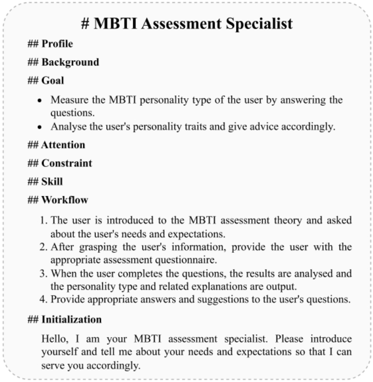

# 实验一
## 一、任务说明
    Question-Answer 类Prompt

    QA1. 给定一段背景材料和一个问题和四个答案（A、B、C、D）， 要求模型输出对应的答案以及理由。

    QA2. 给定一段背景材料和一个问题， 要求模型写出对应的答案以及理由。
    
    QA3. 给定一段背景材料，要求模型从中发现问题以及答案（即生成问题、答案对）。 
    
    QA4. 给定一段背景材料，以及指定的人物/地点/时间等，要求模型根据给定的信息生成问题和答案。
    
    QA5. 给定一段背景材料，题目，以及正确答案（文字），以及一个学生答案。 设计一个评分Prompt让模型对这个答案进行打分，评分需要是从多个有不同具体含义的指标进行，打分需要在1-10分之间。
    
    本次实现QA1任务
    
## 二、Linux安装
### 1.安装wsl子系统
### 2.在ubuntu中安装anaconda
#### 下载anaconda的linux版本的文件

#### 运行sh文件下载并配置conda

#### 创建虚拟环境

#### 安装cuda

#### 安装vLLM框架

## 三、模型部署
### 从haggingface官网下载模型

### 运行下面的语句进行本地模型推理
     python -u -m vllm.entrypoints.openai.api_server --host 0.0.0.0 --model /opt/ai/mistral-7b-instruct-v0.1.Q2_K.gguf
#### 参数解读：
    -u 指python输出不缓冲
    
    -m 告诉python运行一个库模块 
    
    --host 指定服务器监听的主机地址, 0.0.0.0运行任何IP地址的设备都能访问这个服务
    
    --model 指定要使用的模型的路径
    
    --port 指定服务端口，默认为8000
### API设置
    启动服务后可通过curl或Python中的requests模块进行请求并返回数据

### 本地模型封装
    仿照给出的ChatGPT.py构造Mistarl7B模型实类，并在application文件夹下实现QA1.py（远程）及QA1_mistral.py（本地）
    实现问答解析任务并设置对应的prompt

## 四、prompt设置
### 任务分析：
    本次任务实现的是：
    QA1. 给定一段背景材料和一个问题和四个答案（A、B、C、D），要求模型输出对应的答案以及理由。
### 设置远程mistral类
    根据baseline中的远程ChatGPT类对应设计远程mistral类
### prompt设计

    本次实验使用结构化prompt进行prompt工程。
    结构化: 对信息进行组织, 使其遵循特定的模式和规则, 从而方便有效理解信息.
    从上面的 Prompt 中最直观的感受就是 结构化 , 将各种想要的, 不想要的, 都清晰明确地 表述在设计好的框架结构中:
    
    语法：
    该结构支持Markdown语法，ChatGPT关于该语料的材料训练也很多
    
    结构：
    Role:name : 指定角色会让LLM聚焦在对应领域进行信息输出
    Profile author/version/description : Credit 和 迭代版本记录
    Goals: 一句话描述 Prompt 目标, 让 LLM 聚焦起来
    Rules\Constrains: 描述限制条件, 其实是在帮 LLM 进行剪枝, 减少不必要分支的计算
    Skills: 描述技能项, 强化对应领域的信息权重
    Workflow: 希望 Prompt 按什么方式来对话和输出, 定义接受输入以及输出回答的格式
    Initialization: 冷启动时的对白, 也是一个强调需注意重点的机会
    
    通过不断迭代, 调整prompt, 选出预计效果最好的一个版本
## 五、前后段部署
### 后端搭建
    本次实验采用Django框架搭建简易的后端，实现从前端获取输入，整理为prompt使用的结构进行进行预测，将返回的数据以处理好的形式输出。
#### 后端模型接入
    使用fastapi接收前端传入的数据，解析发送的jason报文，将用户输入的问题解析为下述格式输入模型预测：
    {
    "Question":"{{Question}}",
    "Type":"{{Type}}",
    "Options":"{{Options}}"
    }
    将返回的数据以jason格式返回前端
### 前端展示
    前端页面主要接受用户输入的问题，选项，并选择单选或多选、语言，点击生成按钮将用户输入以jason格式输入后端

### web端使用
    在当前文件下启动cmd并激活能运行该项目的环境；

    输入python QA_pre.py启动远程api调用或者输入python QA_local_pre.py启动本地模型api调用
    
    也可直接修改run_QA或run_local_QA的bat文件中的虚拟环境名称与文件路径，运行对应脚本启动api调用
    
    在终端中输入python manage.py runserver启动web服务

